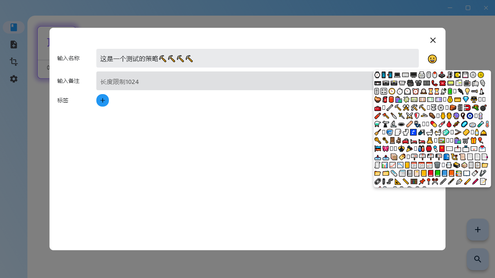
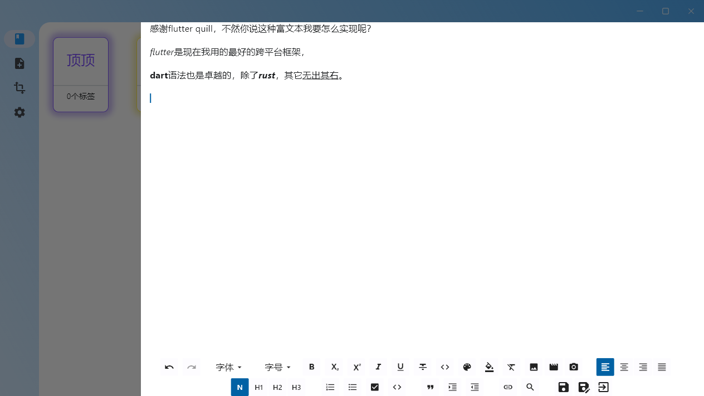

# weaving

[中文](./README_CN.md)

A Flutter project with `riverpod` and `isar`, supports desktop and mobiles.

### mainly third-party dependencies

* [isar](https://pub.dev/packages/isar)
* [flutter_riverpod](https://pub.dev/packages/flutter_riverpod)
* [flutter_quill](https://pub-web.flutter-io.cn/packages/flutter_quill)

### screenshots

