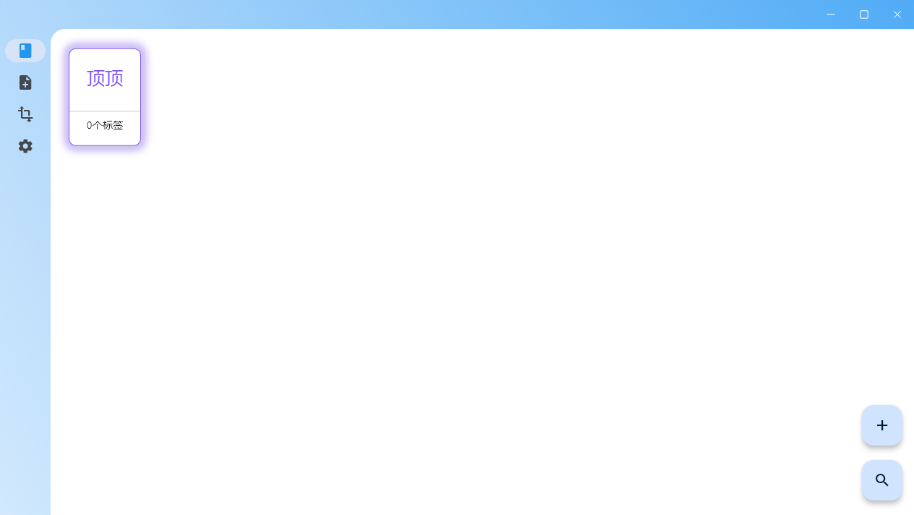
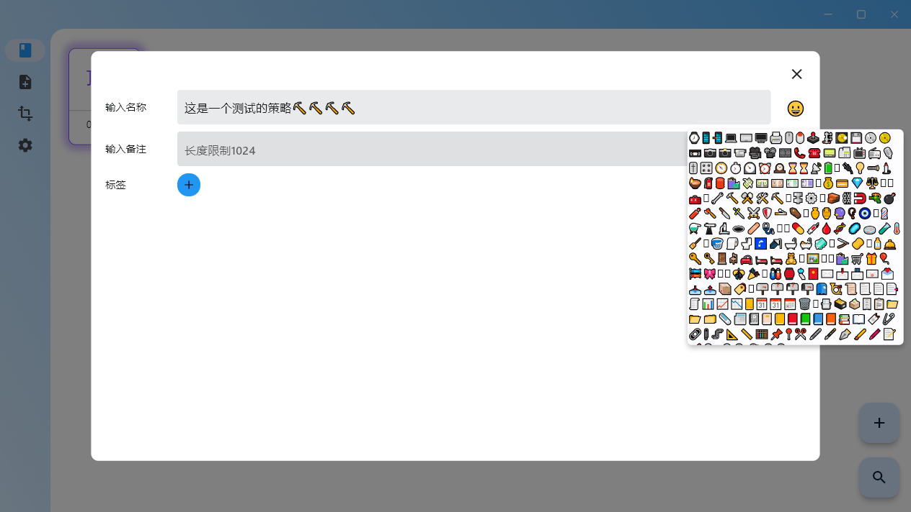
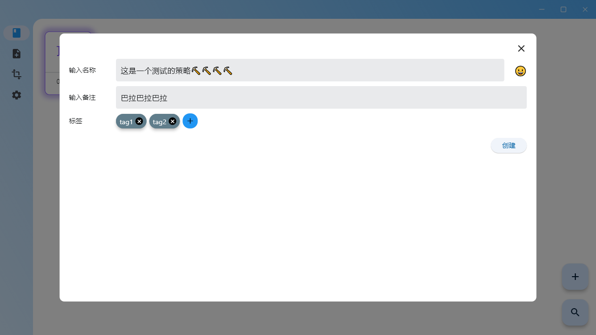
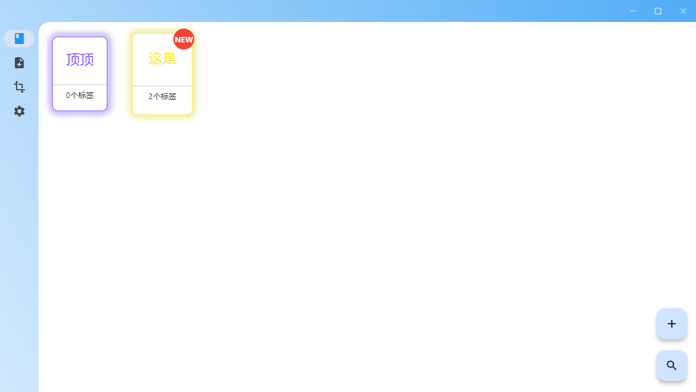
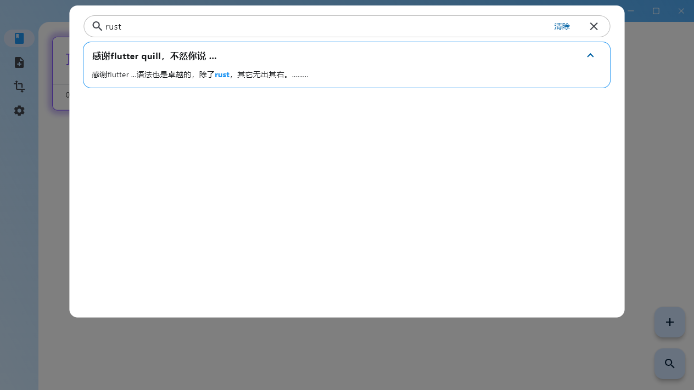
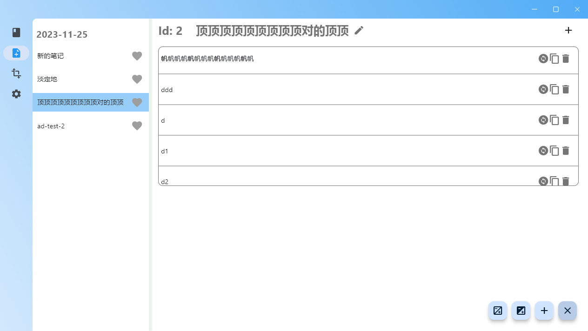

# weaving

[English](./README.md)

> 早些年玩dota，第一批接触的英雄里最喜欢的还是蚂蚁（地穴编织者，Nerubian Weaver）。后来在dota2故事设定里，蚂蚁变成了什么“创世之纱”,什么“现实之网”的维护者，从一个地穴刺客摇身一变成了个设定逆天的反骨仔。
>
> 现实与过往不断编织成每个人不同的人生，然而并不能“回到过去”。所以，不该找个简单的工具记录一下吗？

### 第三方依赖（主要）

* [isar](https://pub.dev/packages/isar)
* [flutter_riverpod](https://pub.dev/packages/flutter_riverpod)
* [flutter_quill](https://pub-web.flutter-io.cn/packages/flutter_quill)

### milestones

- [ ] todo list/kanban  and gantt

### 一些截图

